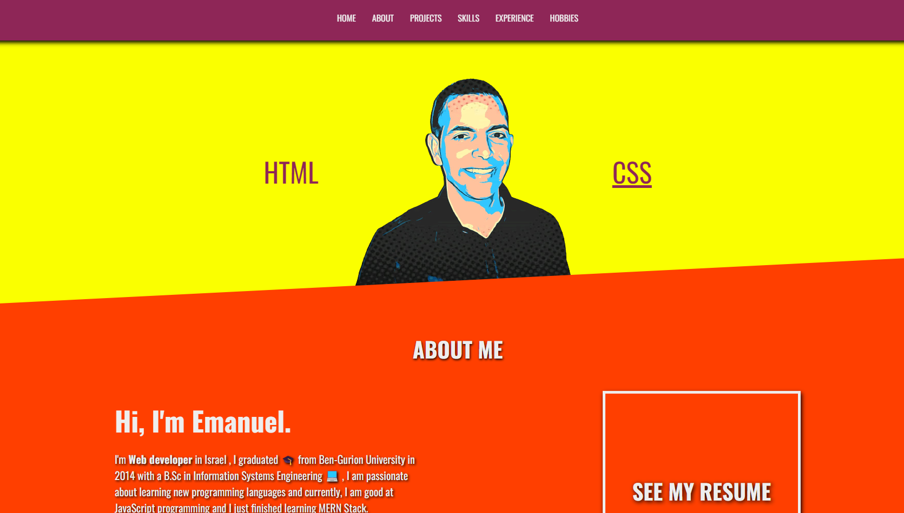

# Portfolio html css

## About:

This portfolio built with html and css only as assignment in the appleseeds bootcamp

 ## Languages and Tools:
 

  
 
 
 

## 🚀 Demo:

https://angry-bartik-0503ed.netlify.app/

